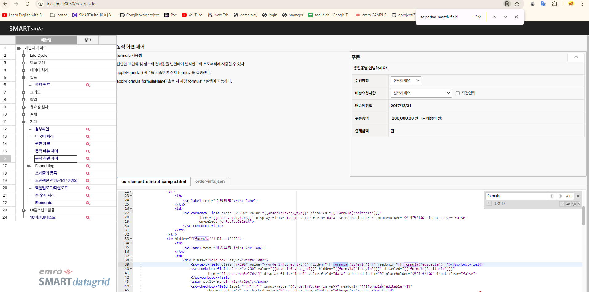

1. How do you group and process Vallidator processing? (5 points)
①
validate 

②
validategroup 

③
```validate-group```

④
validation-group

2. What event is called when the status value of the selected row changes? (5 points)
http://techdocs.emro.co.kr/display/SF10/sc-grid+API
※ See sc-grid API

①
changeItemState

②
stateChanged

③
itemChanged

④
```itemStateChanged```


3. This is a technology that packages front-end resources used by clients into jar files. Representative examples include sc-component.jar, sc-upload.jar, and sc-upload.jar. What is this technology? (5 points)
①
FrontEndJars

②
RsourceJars

③
WebJars

④
JsJars


4. What class is responsible for handling all errors that occur in the application? (5 points)
http://techdocs.emro.co.kr/pages/viewpage.action?pageId=80381595

※ Refer to the error page designation

①
AllExceptionHandler

②
ConsoleExceptionHandler

③
DefaultExceptionHandler

④
```SpringWebExceptionHandler```

5. Which of the following is a correct description of the 'stateful' option in scheduler management? (5 points)
http://techdocs.emro.co.kr/pages/viewpage.action?pageId=80380815

※ 1. See Batch Scheduler Registration

①
This is an option to check whether the scheduler was executed normally.

②
Option to have multiple instances when running the scheduler.

③
```This is an option to prevent the same job from being executed before the previous task is finished when the scheduler is executed.```

④
This is an option to run the same job at the same time even if the previously executed task has not finished when the scheduler is executed.


6. When using multiple transactions, all defined data source connections are secured, resulting in an excessive connection pool. What class should be used to create a connection at the time the data source is used? (5 points)
①
AfterConnectionDataSourcePorxy

②
AsyncConnectionDataSourcePorxy

③
LaterConnectionDataSourcePorxy

④
LazyConnectionDataSourcePorxy


7. The following are common services that are absolutely necessary after login authentication and before the initial Main (MDI) screen. What is wrong with the service request URL? (5 points)
Check the information called when logging in (using developer tools)

Multilingual information (getByLastUpdated.do)

①
Session information (getSessionUser.do)

②
User permissions information (getUserRoles.do)

③
Multilingual information (getAvailableLocalizedLocales.do)

④
Menu information (findListMenu.do)
8. tr hidden=(5 points)
https://smartx-10.emro.co.kr/devops.do
※ See Other > Dynamic Screen Control

①
{{formula('isView')}}

②
{formula('isView')}

③
`[[formula('isView')]]`

④
[formula('isView')]





9. 10.0 What file checks the contents of the XSS filter applied in the solution? (5 points)
http://techdocs.emro.co.kr/pages/viewpage.action?pageId=80381575 

※ Refer to Cross-site Scripting (XSS)

①
web.xml

②
```security-context.xml```

③
web.xml/security-context.xml

④
web.xml / security-context.xml / trasaction-context.xml

10. How do you use es-date-field to receive a date in string format? (5 points)
https://smartx-10.emro.co.kr/devops.do
※ Field > See main fields

①
string format

②
string_format

③
`string-date`

④
string_date


11. Regarding the database, we have a default propagation/isolation setting so that all services have the same transaction. What is the default setting? (5 points)
①
REQUIRED

②
REQUIRES_NEW

③
MANDATORY

④
NEVER


12. What event is called when an element is selected when calling tab-navigation? (5 points)
https://smartx-10.emro.co.kr/devops.do
※ Refer to module configuration


①
item-active

②
active-item

③
`?????item-select`

④
select-item


13. This is an attack that causes a user to request a specific website to perform an action (modification, deletion, registration, etc.) intended by the attacker without the user's consent. This is also called cross-site request forgery. What verification method is being used to prevent this? (5 points)
http://techdocs.emro.co.kr/pages/viewpage.action?pageId=80381583

※ See CSRF defense

①
Referer Verification

②
```CSRF Token Verification```

③
XSS Verification

④
Use CAPTCHA


14. How do I set up the grid copy protection function? (5 points)
http://techdocs.emro.co.kr/display/SF10/sc-grid+API
※ See sc-grid API

①
copyDisabled

②
```copyEnabled```

③
disabledCopy

④
enabledCopy


15. Here are the log settings: logging.destination=C://smartsuite logging.level=INFO logging.lightLogging=false logging.includeControllerParameter=true logging.includeServiceParameter=false logging.forceLoggingList=\ Which of the following options would reduce the information in the log due to performance or capacity issues? (5 points)
http://techdocs.emro.co.kr/pages/viewpage.action?pageId=80382319

※ Refer to Execution Log

Subjective answer: `logging.lightLogging`

16. How to call only the [readOnly] formula again in Event after saving? (5 points)
https://smartx-10.emro.co.kr/devops.do
※ See Other > Dynamic Screen Control

Subjective answer 

17. When the myFunction function is defined as shown below in JavaScript, describe the result value that appears when calling the myFunction function (20 points)
{code}

myFunction: function(data1, data2){

 var result = null;

 

 if(data1 && data2){

  result = data1 + data2;

 }

 

 result;

}

{code}

The result when calling myFunction(-1, 1); is: 0

The result when calling myFunction(0, 1); is: null

The result when calling myFunction(null, 2); is: null

The result when calling myFunction("1", 2); is: 12

The result when calling myFunction("", 2); is: null

5. What TransactionManager object are you using to use multiple transactions? (5 points)
http://techdocs.emro.co.kr/pages/viewpage.action?pageId=80382828

※ Refer to Development Environment Settings (Database)

①
`ChainedTransactionManager`

②
DataSourceTransactionManager

③
 DefaultTransactionManagerLookup

④
JtaTransactionManager


7. How to set an extension that cannot be attached in the attachment component? (5 points)
https://smartx-10.emro.co.kr/devops.do 

※ Other > See attached file

①
limit-extension

②
restrict-extention

③
ban extension

④
prohibit-extension

11. What component is used when indicating From-To for year/month? (5 points)
https://smartx-10.emro.co.kr/devops.do
※ Field > See main fields

①
sc-period-date-filed

②
sc-date-period-field

③
`sc-period-month-field`

④
sc-month-period-field


12. Which property sets additional options for downloading Excel from the grid function? (5 points)
http://techdocs.emro.co.kr/display/SF10/sc-grid+API
※ See sc-grid API

①
excelOptions

②
downloadExcelOptions

③
`exportOptions`
④
exportExcelOptions


16. How do I allow only PDF attachments in my attachments? (5 points)
https://smartx-10.emro.co.kr/devops.do
※ Other > See attached file

Subjective answer: = extension="pdf"


17. The module below is not currently being printed. The purpose of the em-test module is to call the load function of the es-test module at initialization time. Please find the cause of the non-printing, fix it, and submit it. (20 points)
- Assuming that there are no errors in the es-test module, the load function is defined in the es-test module.

- 1 hint script error, 2 html related errors


{code}

<sc-link rel="import" href="es-test.html" />

<dom-module id="em-test">

 <style>

  :host {

   @apply(--vbox-layout);

  }

 </style>


 <template>

  <es-test style="esTest" ></es-test>

 </template>


 <script>

  

  Polymer({

   is: 'em-test',

   properties : {

    resultList: {

     type:Array

    }

   },

   initialized : function(){

    me.$.esTest.load("test");

   },

   myTestFunction : function(){

    

   }

  });

 </script>

</dom-module>

{code}

Descriptive answer


Regarding the database, we have a basic propagation/isolation setting so that all services have the same transaction. What is the default setting
`REQUIRED`
REQUIRES_NEW
MANDATORY
NEVER
